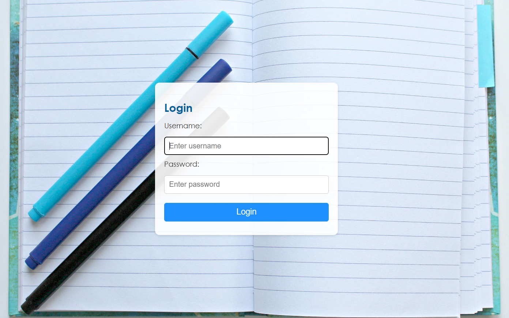
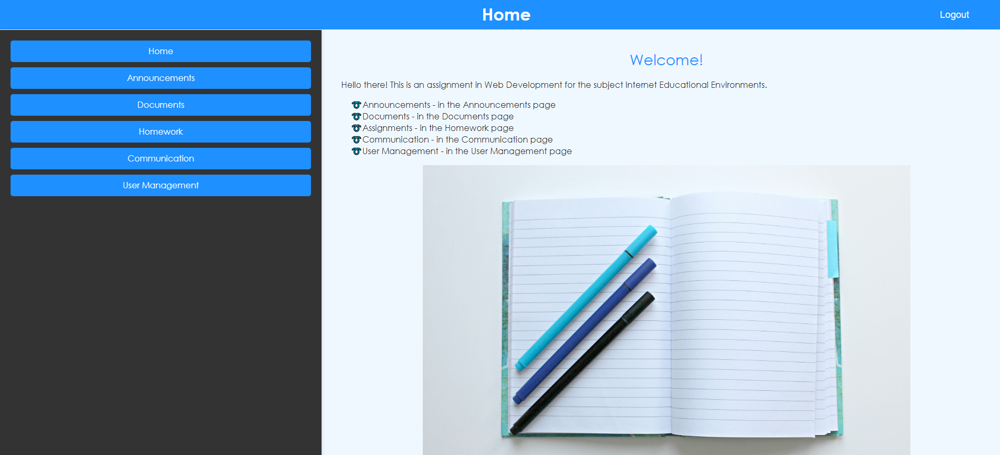
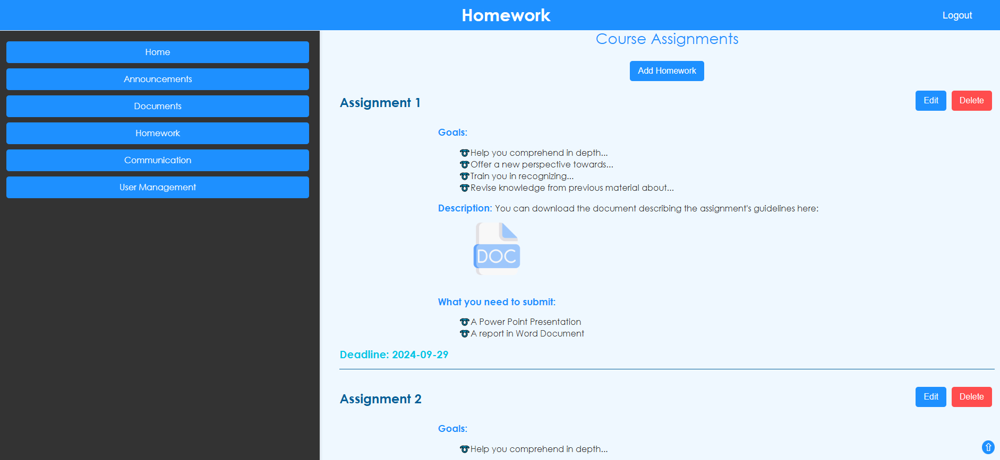
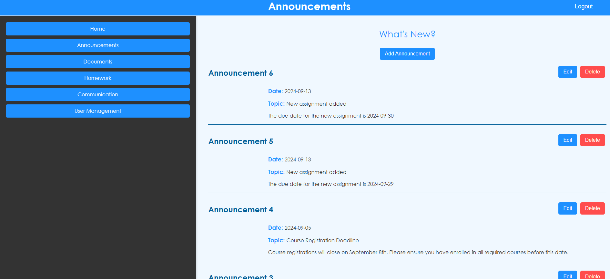
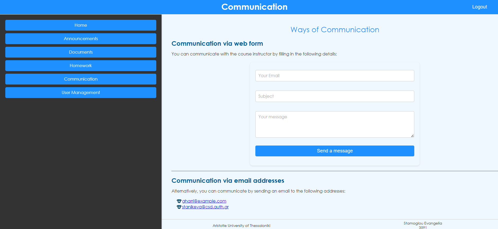
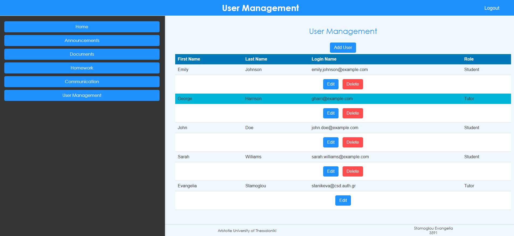

# 🎓 LMS Website

The website is currently running on the link below:  
👉 [LMS Website Live Demo](https://stanikeva.webpages.auth.gr/3591partB/index.php)

## 📖 Description
A responsive platform that helps students and teachers organize, manage, and access learning resources efficiently.

## 📸 Functionality Screenshots

### 🔑 Login

### 🏠 Home

### 📂 Documents

### 📝 Homework

### 📢 Announcements

### 💬 Communication

### 👥 User Management

